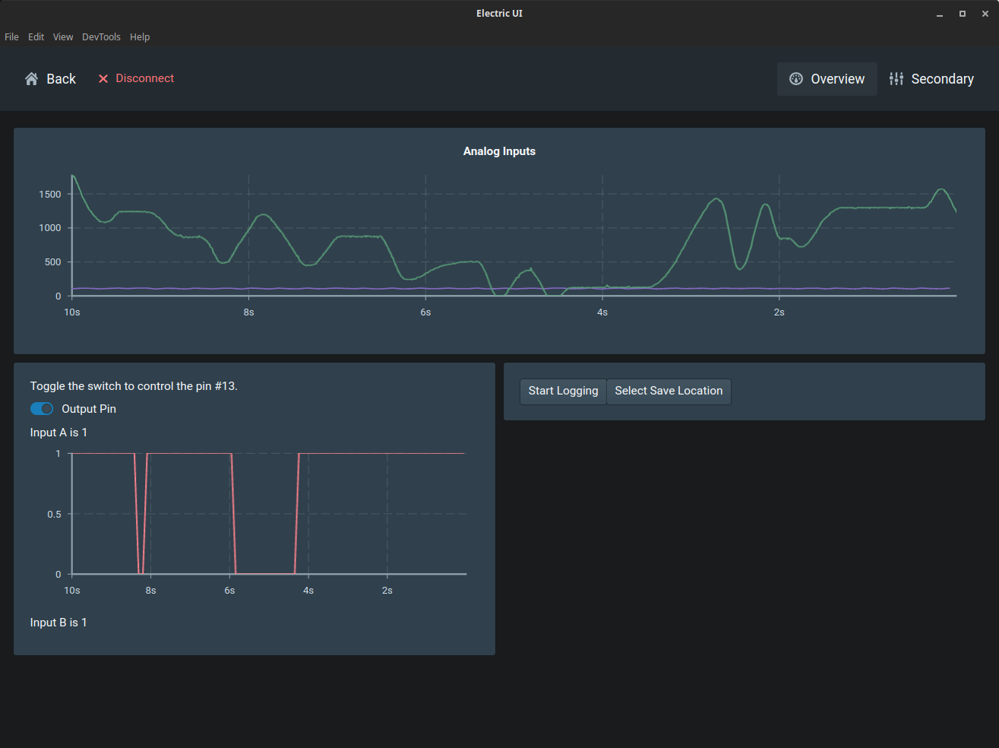

# eui-esp32-adc
Simple demonstration of sampling ADC channels and GPIO state. There are only minor changes to the [Arduino hardware quickstart guide](https://electricui.com/docs/hardware/arduino) and [user-interface quickstart guide](https://electricui.com/docs/interface/quickstart).

## Hardware Setup

This assumes an ESP32 board being used with the Arduino framework. For ESP-IDF setup notes, follow the [IDF quickstart guide](https://electricui.com/docs/hardware/esp32).

I used an [Adafruit ESP32 Feather](https://www.adafruit.com/product/3405) board for this example, flashed with the sketch `arduino-adc-example`.

## Interface

1. The interface in this reposiory assumes you have `arc` [installed](https://electricui.com/install) first.
2. Navigate to the `/interface` folder with the command-line and run `arc start`.
3. Edit the template with your IDE (we recommend VSCode) and changes will update the sandbox immediately.

